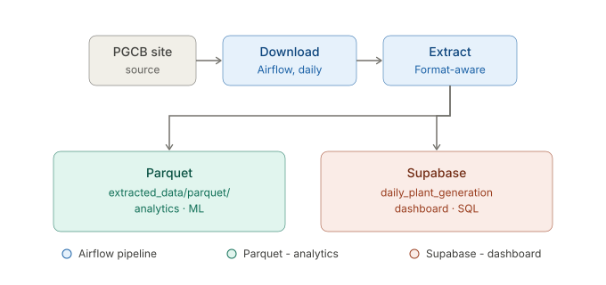

# Electricity Demand & Fuel Forecasting — Bangladesh (PGCB/NLDC)

Research-grade data pipeline over **Power Grid Company of Bangladesh (PGCB) / National
Load Dispatch Center (NLDC)** daily operational reports. Downloads the public reports,
extracts per-plant generation (daily totals + hourly MW), and loads them into a
two-tier store for analysis and dashboards.

Data source: [pgcb.gov.bd](https://www.pgcb.gov.bd/) · coverage **2019-01-02 → present** (daily, auto-updating).

---

## Architecture



Airflow downloads and extracts PGCB reports daily; format-aware extraction fans out to a
Parquet archive (analytics/ML) and a Supabase serving table (dashboard/SQL).

- **Tier 1 — Parquet** (DuckDB/pandas friendly): full-resolution, partitioned by day, free, unlimited. Where modeling happens.
- **Tier 2 — Supabase Postgres**: small clean serving table for the dashboard (anon key + RLS).
- Orchestrated by **Apache Airflow** (Docker Compose, LocalExecutor).

### Report formats
The PGCB sheet layout changed over time; extraction is format-aware:
| Period | Generation sheet | Extractor |
|--------|------------------|-----------|
| 2019–2024 | `YesterdayGen` | `extract_powerplant_generation_data.py` (daily + `process_yesterdaygen_hourly`) |
| 2025–present | `GenLog` / `Genlog` | `extract_genlog.py` (daily + hourly) |

`extract_genlog.process_generation_auto()` routes automatically by which sheet a file has.

---

## Repository layout

```
.
├── script/                     # extractors, downloaders, load layer
│   ├── bs4_downloader.py            # pure-HTTP downloader (used by the pipeline)
│   ├── selenium_downloader.py       # selenium variant (legacy)
│   ├── extract_powerplant_generation_data.py  # YesterdayGen daily + hourly
│   ├── extract_genlog.py            # GenLog (2025+) daily + hourly + auto-router
│   ├── extract_powerplant_info.py   # plant metadata from Forecast sheet
│   ├── extract_area_wise_energy_demand_supply.py
│   ├── load.py                      # two-tier load: Parquet + Supabase upsert + state
│   ├── rename_files_dir.py          # standardize filenames -> yyyy-mm-dd
│   ├── missing_files.py             # gap detection
│   └── config.py / db.py
├── airflow/                    # the ETL stack
│   ├── docker-compose.yaml          # postgres + webserver + scheduler (LocalExecutor)
│   ├── Dockerfile / requirements.txt
│   ├── supabase_schema.sql          # serving-table DDL (run once in Supabase)
│   ├── .env.example                 # AIRFLOW_UID, Fernet, Supabase creds
│   └── dags/
│       ├── backfill_generation_2019_2024.py   # historical daily (YesterdayGen)
│       ├── backfill_generation_2025_2026.py   # historical daily + hourly (GenLog)
│       ├── backfill_hourly_2019_2024.py       # historical hourly (YesterdayGen)
│       └── daily_incremental_etl.py           # ongoing @daily ingestion
├── daily_report/               # 2019-2024 reports (.xlsm)
├── daily_report (2025-01-01 to 2026-06-29)/   # 2025-2026 reports (.xlsx)
├── extracted_data/             # CSV extracts + parquet/ analytics layer
└── monthly_report/             # monthly reliability reports
```

---

## Quick start

### 1. Python env (for the scripts / ad-hoc extraction)
```bash
source env/bin/activate          # deps: pandas, openpyxl, xlrd, beautifulsoup4, requests, supabase, pyarrow, duckdb
```

### 2. Airflow pipeline
```bash
cd airflow
cp .env.example .env             # fill AIRFLOW_UID (50000 on macOS), Fernet/secret keys, Supabase creds
docker compose build
docker compose up airflow-init   # one-shot: db migrate + admin user
docker compose up -d             # webserver + scheduler
```
UI: http://localhost:8080 (admin / admin). On macOS start Docker with `docker desktop start`.

### 3. Supabase serving table
Run `airflow/supabase_schema.sql` once in the Supabase SQL editor (creates `daily_plant_generation`).

---

## DAGs

| DAG | Schedule | Does |
|-----|----------|------|
| `daily_incremental_etl` | `@daily` | finds reports newer than the last loaded date, downloads, extracts, two-tier loads. Idempotent, self-healing. |
| `backfill_generation_2019_2024` | manual | daily per-plant generation for 2019–2024 → Parquet + Supabase |
| `backfill_generation_2025_2026` | manual | daily + hourly for 2025–2026 → Parquet + Supabase |
| `backfill_hourly_2019_2024` | manual | hourly MW series for 2019–2024 → Parquet |

Backfills accept conf params, e.g. `{"start":"2024-12-01","end":"2024-12-31","max_files":5}`.

---

## Data layers

**Parquet** (`extracted_data/parquet/`, partitioned by `year/month/day`):
- `daily_plant_generation/` — `date, plant_name, electricity_gen, fuel_cost`
- `hourly_plant_generation/` — `date, time, plant_name, mw` (STLF series)

Query directly:
```python
import duckdb
duckdb.sql("SELECT date, sum(mw) FROM 'extracted_data/parquet/hourly_plant_generation/**/*.parquet' GROUP BY date")
```

**Supabase** `daily_plant_generation` — PK `(date, plant_name)`, aggregate/total rows filtered out, idempotent upsert.

Current scale (2019–2026): daily **485,483** rows; hourly **12,481,033** rows; Supabase serving table **~481k** rows.

---

## Notes

- Reports use a bad TLS cert; downloaders run with `verify=False`.
- Some reports store numbers as strings with non-breaking spaces — extractors coerce to numeric.
- PGCB did not publish reports on a few dates (genuine gaps, not download misses).
- **Security:** the ETL uses the Supabase `service_role` key (backend only, bypasses RLS). Never commit it or use it in a frontend — build dashboards with the `anon` key + RLS policies.

## License
[MIT](LICENSE)
